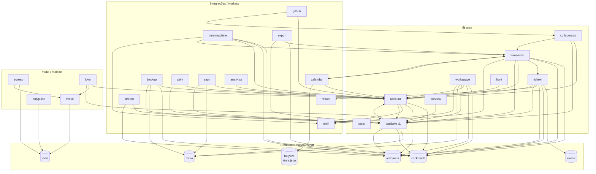

# INFRA.md — Mapa de containers da VPS (produção)

> **Dono único deste tema.** O que roda na VPS, de onde vem cada imagem, o que é stateful
> e o que a esteira de CI/CD pode ou não tocar. Gerado em 2026-07-03 por análise
> somente-leitura de `dev/docker-compose.vps.yaml`, `3f-build.sh`,
> `common/scripts/docker_build.sh`, `dev/nginx/3ftasks.conf` e do código dos pods.
> **Como** buildar/deployar → `3f-docs/BUILD_AND_DEPLOY.md`. Estratégia da esteira →
> `3f-docs/features/projeto-pedro/estrategia-cicd.md`.

---

## 1. Tabela-mestra

Categorias para o pipeline:
🟢 **app pod** — redeploy seguro pela esteira · 🔴 **serviço de dado** — NUNCA recriar pela esteira · 🟡 **infra auxiliar** — upstream, mexer só manualmente.

| Serviço (compose) | Imagem | Nossa build? | Pasta do pod | Stateful? | Categoria |
|---|---|---|---|---|---|
| `front` | `hardcoreeng/front:3f-local` | ✅ | `pods/front` | não | 🟢 |
| `account` | `hardcoreeng/account:3f-local` | ✅ | `pods/account` | não | 🟢 |
| `transactor_cockroach` | `hardcoreeng/transactor:3f-local` | ✅ | `pods/server` | não | 🟢 (restart = reconnect storm) |
| `workspace_cockroach` | `hardcoreeng/workspace:3f-local` | ✅ | `pods/workspace` | não | 🟢 (roda migrations) |
| `collaborator` | `hardcoreeng/collaborator:3f-local` | ✅ | `pods/collaborator` | não (grace 60s) | 🟢 |
| `fulltext_cockroach` | `hardcoreeng/fulltext:3f-local` | ✅ | `pods/fulltext` | não | 🟢 |
| `preview` | `hardcoreeng/preview:3f-local` | ✅ | `pods/preview` | cache efêmero | 🟢 |
| `github` | `hardcoreeng/github:3f-local` | ✅ | `services/github/pod-github` | não | 🟢 |
| `mail` | `hardcoreeng/mail:3f-local` | ✅ | `services/mail/pod-mail` | não | 🟢 |
| `calendar` | `hardcoreeng/calendar:3f-local` | ✅ | `services/calendar/pod-calendar` | não (estado no hulykvs/account) | 🟢 |
| `time-machine` | `hardcoreeng/worker` **(sem tag!)** | ✅ | `services/worker` | não (estado no cockroach) | 🟢 — corrigir tag |
| `datalake` | `hardcoreeng/datalake:v0.7.413` **upstream** | ⚠️ buildável, não usado | `services/datalake/pod-datalake` | não (dados no minio+cockroach) | ⚠️ decidir fonte |
| `hulykvs` | `node:20-slim` + `server.js` montado | código nosso, sem imagem | `services/hulykvs` | **SIM** (`store.json`) | 🔴 |
| `stream` | `hardcoreeng/stream:v0.7.413` | ❌ (código nem está no repo) | — | não | 🟡 |
| `stats` | `hardcoreeng/stats:v0.7.413` | ❌ | `pods/stats` (não buildado) | memória volátil | 🟡 |
| `rekoni` | `hardcoreeng/rekoni-service:v0.7.413` | ❌ | `services/rekoni` (não buildado) | não | 🟡 |
| `print` | `hardcoreeng/print:v0.7.413` | ❌ | `services/print/pod-print` | não | 🟡 |
| `sign` | `hardcoreeng/sign:v0.7.413` | ❌ | `services/sign/pod-sign` | não (cert montado do repo!) | 🟡 |
| `analytics` | `hardcoreeng/analytics-collector:v0.7.413` | ❌ | `services/analytics-collector` | não | 🟡 (provável morto) |
| `export` | `hardcoreeng/export:v0.7.413` | ❌ | `services/export/pod-export` | não | 🟡 |
| `love` | `hardcoreeng/love:v0.7.413` | ❌ | `services/love` | não | 🟡 |
| `hulypulse` | `hardcoreeng/hulypulse:v0.7.423` | ❌ (fonte Rust em `foundations/hulypulse`) | — | não (Redis, TTL≤1h) | 🟡 |
| `backup-cockroach` | `hardcoreeng/backup:v0.7.413` | ❌ | `pods/backup` (não buildado) | não (grava no minio) | 🟡 |
| `cockroach` | `cockroachdb/cockroach:latest-v24.3` | ❌ | — | **SIM** — banco de TUDO | 🔴 |
| `redpanda` | `redpanda:v24.3.6` | ❌ | — | **SIM** — tópicos+offsets | 🔴 |
| `minio` | `minio/minio` **(:latest!)** | ❌ | — | **SIM** — blobs+backups | 🔴 |
| `elastic` | `elasticsearch:7.14.2` | ❌ | — | **SIM** — índice derivado (recriável via FullReindex, caro) | 🔴 |
| `redis` | `redis:8.0.2-alpine3.21` | ❌ | — | efêmero (sem volume) | 🟡/🔴 não recriar em horário de uso |
| `livekit` | `livekit/livekit-server:latest` **(!)** | ❌ | — | não (estado no redis) | 🟡 |
| `livekit-egress` | `livekit/egress:latest` **(!)** | ❌ | — | staging tmp | 🟡 (ocioso — gravação desativada) |

Bind-mounts de dados (persistem reboot): `/opt/apps/os-tasks/data/{cockroach,redpanda,minio,elastic,hulykvs}`.
Named volumes `db:` e `dbpg:` no fim do compose são **órfãos** (ninguém monta); só `livekit_egress_tmp` é usado.

---

## 2. Fichas por serviço

### 2.1 Pods buildados por nós (`:3f-local`)

Transversais: todos empurram métricas para o `stats` (push, não pull); **nenhum deles tem
healthcheck no compose exceto `account`** (e é só teste TCP); `SERVER_SECRET` é a chave de
assinatura de token do cluster inteiro, idêntica para todos os pods — **rotacionada em
2026-07-09** (commit `71990885e`): não é mais o default `secret`; agora vem parametrizada
como `${SERVER_SECRET}` a partir do `dev/.env` (não versionado). ⚠️ **MinIO ainda usa o
default `minioadmin/minioadmin`** (pendente de rotação). `common/scripts/docker_build.sh:13`
sempre gera **duas tags**: `:3f-local` E `:latest`.

#### front
- **Papel**: serve a SPA (bundle webpack), `GET /config.json` (config de runtime pro browser) e handler `/files`. Porta de entrada do browser (nginx 443 → 8087).
- **Imagem**: nossa; `pods/front/Dockerfile` (base `hardcoreeng/front-base:v20250916`). Build: webpack em `dev/prod` → `rushx bundle` → cópia do `dist` → docker build.
- **Estado**: stateless. Recriar não perde nada, mas a imagem **embute o frontend** — bundle stale = UI velha (rebuild `--clean` após MODEL_VERSION bump).
- **Deps**: account (URL pública via config.json!), stats. Reverso: usuários/nginx.
- **Saúde**: sem healthcheck no compose; sem `/health` no código — `GET /config.json` serve de probe não autenticada.
- **Riscos**: env aponta para serviços inexistentes (payment, backup-api, link-preview, hulylake) → features quebram silenciosas; `STREAM_URL=http://stream:1080` e `EXPORT_URL=http://export:4009` entregam **hostname interno ao browser** → gravação de tela e export provavelmente quebrados em prod; portas 8087 **e** 8088 mapeiam pro mesmo 8080.

#### account
- **Papel**: autenticação, tokens, workspaces, seleção de endpoint do transactor por região; F11 (login universal via 3F Core, `THREEF_CORE_ENABLED=true` — **live em produção**) e proxy de org-structure do dashboard.
- **Imagem**: nossa; `pods/account/Dockerfile`. Porta 3000 (host 13000, nginx :3000).
- **Estado**: stateless (tudo no cockroach). Monta `branding.json` + `dev/.env.secrets` (THREEF_CORE_API_KEY).
- **Deps**: cockroach, redpanda, stats, mail, datalake. Reverso: **quase todos** (ACCOUNTS_URL) — 2º maior SPOF.
- **Saúde**: único com healthcheck no compose — **TCP puro** (`net.createConnection(3000)`), interval 10s, retries 12, start 30s. `time-machine` espera `service_healthy` dele. Sem rota `/health` no código.
- **Riscos**: healthcheck TCP considera healthy mesmo com DB fora. F11 **está ligado em produção** (`THREEF_CORE_ENABLED=true`, `THREEF_CORE_WORKSPACE=<workspace-uuid-prod>` — workspace real, não mais `CHANGE_ME`); usuários logam **só** via login universal (email+senha validados na 3F Core), com fallback local por admin-email ainda no código.

#### transactor_cockroach
- **Papel**: núcleo de Tx — sessões WebSocket (3332), pipeline + triggers, broadcast de live queries, API REST `/api/v1/*`. Único caminho legítimo de mutação.
- **Imagem**: nossa; `pods/server/Dockerfile`. O bundle **embute `model.json`** (schema) → rebuild obrigatório em version bump. `EXPOSE 8080` no Dockerfile está desatualizado (porta real 3332).
- **Estado**: stateless (dados no cockroach/datalake/redpanda). `metrics.txt` e logs efêmeros.
- **Deps**: cockroach, redpanda, fulltext, account, stats, mail, datalake, calendar (`CALENDAR_URL` p/ trigger OnEvent). Reverso: todos os clientes, collaborator, export, time-machine. `RATE_LIMIT_MAX=1500` (tuning pós-incidente planner).
- **Saúde**: **tem `GET /api/v1/health` pronto** (`pods/server/src/server_http.ts:161` — healthy/degraded/unhealthy 503) e o compose **não usa** — quick win.
- **Riscos**: restart = reconnect storm (todos os clientes reconectam de uma vez, 1–3 min de hang; nunca reiniciar em loop com CPU saturada); imagem stale = modelo velho.

#### workspace_cockroach
- **Papel**: ciclo de vida de workspaces — cria, roda **migrations/upgrades** quando MODEL_VERSION sobe, arquiva, migra região. Não atende usuário final.
- **Imagem**: nossa; `pods/workspace/Dockerfile`. Bundle embute o model (builder `model-all`) → rebuild em version bump.
- **Estado**: stateless. `WS_OPERATION=all+backup` confirmado no código: **exige** `BACKUP_STORAGE`/`BACKUP_BUCKET` (exit 1 se faltar), mas o backup dele só roda em fluxos de arquivamento/migração — o backup periódico é o `backup-cockroach`.
- **Deps**: cockroach, redpanda, account, datalake, minio (backup), mail. Reverso: ninguém em runtime (worker de fila).
- **Saúde**: **zero HTTP** — sem porta, sem healthcheck. Workspace parado = upgrade não roda e criação de workspace trava, **sem alarme**.
- **Riscos**: `FULLTEXT_URL` ausente no compose → não limpa índice ao arquivar/deletar workspace; falha silenciosa por falta de observabilidade.

#### collaborator
- **Papel**: edição colaborativa (Hocuspocus/Yjs) das descriptions — porta 3078 (nginx :3078). Toda edição de description passa por ele (regra de ouro).
- **Imagem**: nossa; `pods/collaborator/Dockerfile`.
- **Estado**: docs Yjs em memória com persist no datalake (debounce 2s, max 10s) — por isso `stop_grace_period: 60s`. Kill abrupto perde ~10s de edição.
- **Deps**: account, datalake, transactor, stats. Reverso: browsers (wss), github.
- **Saúde**: sem healthcheck; só `/api/v1/statistics` autenticado.
- **Riscos**: datalake com falha (ex.: 401 de imagem stale) = descriptions não gravam, perda silenciosa; gc desabilitado nos ydocs → memória cresce em docs muito editados.

#### fulltext_cockroach
- **Papel**: indexação/busca — consome fila Kafka, extrai com rekoni, indexa no elastic; transactor consulta via `PUT /api/v1/search`. Reindex sob demanda (`/api/v1/reindex`, dev/tool `fulltext-reindex-all`).
- **Imagem**: nossa; `pods/fulltext/Dockerfile`; embute o model → **na lista default do build por isso** (stale = busca morta, incidente conhecido).
- **Estado**: stateless (índice no elastic, offsets no redpanda). Restart **nunca** reindexa sozinho.
- **Deps**: elastic (`service_healthy` — única condição forte), cockroach, redpanda, rekoni, datalake, account. Reverso: transactor, dev/tool.
- **Saúde**: **nenhuma rota de probe** — todas as rotas são PUT autenticados. Pod fora da fila = busca degrada silenciosa (incidente redpanda nofile).
- **Riscos**: `HULYLAKE_URL=http://hulylake:8096` aponta p/ serviço comentado; `COMMUNICATION_API_ENABLED=true` aqui vs `false` no front/transactor (inconsistência).

#### preview
- **Papel**: thumbnails/preview de imagem (`GET /image/:transform/...` — sharp/heic/poppler) lendo blobs do datalake. Nginx `/image/` → 14040.
- **Imagem**: nossa; `pods/preview/Dockerfile` (base `preview-base:v20250916`). **Fora da lista default do 3f-build.sh** — só com `--pod preview`.
- **Estado**: cache LRU em `/data/cache` **sem volume** → efêmero; recriar só recomputa (CPU).
- **Deps**: datalake. Reverso: browsers via nginx.
- **Saúde**: sem healthcheck; `GET /` (banner) serve de probe.
- **Riscos**: stale image (fora do default); tempestade de recompute de thumbnail pós-restart.

#### github
- **Papel**: GitHub App `os-tasks` — webhooks em `/api/webhook`, sync bidirecional issues/PRs. Porta 3500 (nginx :3500).
- **Imagem**: nossa; `services/github/pod-github/Dockerfile` (EXPOSE 3078 **errado**; porta real 3500).
- **Estado**: stateless — integrações no account, docs via transactor, descriptions via collaborator.
- **Deps**: account, collaborator, GitHub API; segredos via `dev/.env.github` (APP_ID/CLIENT_ID/CLIENT_SECRET/PRIVATE_KEY — processo morre sem eles → restart-loop). `DB_URL`/`STORAGE_CONFIG` no compose aparentam env morto (config não lê).
- **Saúde**: sem healthcheck; sem rota GET de probe.
- **Riscos**: rotação manual de segredos; PRIVATE_KEY inválida = crash-loop.

#### mail
- **Papel**: gateway SMTP — único endpoint `POST /send` (nodemailer/Gmail). Usado por account, transactor, workspace e time-machine (digest).
- **Imagem**: nossa; `services/mail/pod-mail/Dockerfile` (EXPOSE 8097 diverge do PORT=8092 real).
- **Estado**: stateless, sem fila — email em trânsito num kill se perde.
- **Deps**: smtp.gmail.com; credenciais via `dev/.env.secrets`. Reverso: account, transactor, workspace, time-machine.
- **Saúde**: sem healthcheck; 404 handler prova liveness.
- **Riscos**: **erros de envio são engolidos** (loga e responde 200 — caller acha que enviou); `API_KEY` não setada → `/send` aberto na rede docker interna (sem porta no host, mitigado); app password do Gmail pode revogar silenciosamente.

#### calendar
- **Papel**: sync bidirecional Google Calendar — OAuth, push do Google (`/push`), eventos do Huly (`/event` via trigger do transactor), sync periódico 30min, endpoints `/admin/*` de diagnóstico (fork). Nginx `/_calendar/` → 18095.
- **Imagem**: nossa; `services/calendar/pod-calendar/Dockerfile`.
- **Estado**: stateless no container, estado externo crítico: tokens OAuth no **account**, syncTokens/watch channels no **hulykvs**. Perder o hulykvs = full resync.
- **Deps**: account, hulykvs, transactor, Google APIs, `Credentials` de `.env.secrets` (sem ela, boot morre). Reverso: transactor (CALENDAR_URL).
- **Saúde**: sem healthcheck; `/admin/locks` e `/admin/clients` para diagnóstico.
- **Riscos**: incidente N+1 conhecido (findOne por evento sem índice → satura transactor; mitigação: `docker stop` do calendar); watch channels dependem do `WATCH_URL` público.

#### time-machine (worker)
- **Papel**: worker 3F — (1) fila time-machine (eventos atrasados), (2) **PDCA** (recorrência de issues), (3) **digest diário** por email (08:30 BRT). Re-agenda tudo no boot.
- **Imagem**: nossa, **mas sem tag** — o bloco do worker no `3f-build.sh` não exporta `DOCKER_VERSION`, então sai só `hardcoreeng/worker:latest` + `:git-sha`, e o compose referencia `hardcoreeng/worker` (= `:latest`). O esqueleto do serviço veio do upstream (que também publica `hardcoreeng/worker`): **um `docker pull`/`compose pull` na VPS sobrescreveria PDCA + digest silenciosamente**.
- **Estado**: stateless; schema `time_machine` no cockroach (`delayed_events`, `digest_runs` — idempotência de digest).
- **Deps**: cockroach (`${DB_CR_URL}`), redpanda, account (**`service_healthy`**), transactor (REST interno), mail. Reverso: ninguém.
- **Saúde**: **zero HTTP**; monitoração só por logs.
- **Riscos**: a tag (corrigir p/ `:3f-local` no build e no compose); carrega o model → rebuildar em version bump; crash-loop invisível.

#### hulykvs (caseiro)
- **Papel**: KV store HTTP mínimo **escrito por nós** (substitui o hulykvs Rust upstream não publicado). API compatível com `@hcengineering/kvs-client`. Único consumidor: **calendar**.
- **Imagem**: nenhuma — `node:20-slim` + `services/hulykvs/server.js` montado por volume.
- **Estado**: **STATEFUL** — Map em memória espelhado em `/opt/apps/os-tasks/data/hulykvs/store.json` (write atômico, debounce 200ms, flush em SIGTERM). Guarda syncTokens/historyIds/watch channels do Google Calendar. Apagar o bind-mount = full resync de todos os calendários.
- **Saúde**: sem healthcheck; `GET /api/<ns>` (lista chaves) serve de probe.
- **Riscos**: **sem autenticação nenhuma** (qualquer container na rede docker lê/escreve/apaga — sem porta no host, mitigado); arquivo JSON único reescrito inteiro a cada save; kill -9 perde até 200ms de writes.

### 2.2 Serviços rodando imagem upstream (`hardcoreeng/*:v0.7.4xx`)

Transversais: **nenhum é buildado pelo 3f-build.sh** (mesmo os com código no repo);
**nenhum tem healthcheck**; todos pinados em `v0.7.413` (hulypulse `v0.7.423`). Padrão de
risco: version drift vs código `:3f-local` (mesma família dos incidentes fulltext/datalake).

| Serviço | Papel | Notas e riscos específicos |
|---|---|---|
| **stream** | Upload (TUS) e serving de gravações de tela do plugin recorder; storage=datalake, fila=redpanda | Código **não existe no repo**. Porta 1080 no host sem nginx. `STREAM_URL` interno entregue ao browser → feature provavelmente quebrada em prod. |
| **stats** | Agregador de métricas (todos fazem push; admin consulta) | Estado em memória (restart zera, ok). Porta 4900 no host; token = `secret`. Perda não afeta usuários. |
| **rekoni** | Extração de texto de arquivos (PDF/docs) p/ indexação | `SECRET` não setado no env dele → validação de token depende do default da imagem. Porta 4004 no host. Queda = indexação de anexos degrada silenciosa. |
| **print** | Gera PDF via Chromium/puppeteer | `ALLOWED_HOSTNAMES` não setado → `/print` aceita **qualquer URL** = SSRF para usuário autenticado. Porta 4005 no host. Chromium pesado p/ 4 cores. |
| **sign** | Assina PDFs (`POST /sign`) | **Usa o certificado de DEBUG commitado no git** (`services/sign/pod-sign/debug/certificate.p12`) com senha vazia → assinatura sem valor probatório e "chave privada" pública. Porta 4006 no host. Candidato a desligar se ninguém usa. |
| **analytics** | Coletor de telemetria → PostHog | **Provavelmente morto**: sem POSTHOG_* no compose e nenhum serviço aponta pra ele. RAM à toa; candidato a remoção. Porta 4017 no host. |
| **export** | Export de dados (JSON/CSV) | `EXPORT_URL=http://export:4009` vai ao **browser** → botão de export provavelmente quebrado. Acessa o cockroach direto com versão upstream → risco de drift de modelo. Porta 4009 no host. |
| **datalake** | Storage de blobs — **STORAGE_CONFIG de quase todos** | ⚠️ **Inconsistência ativa**: compose usa upstream `v0.7.413`, mas `./3f-build.sh --pod datalake` builda `:3f-local` e reinicia o container **sem efeito** (no-op de imagem). SPOF de uploads/downloads/descriptions (incidente 401 registrado). Decidir UMA fonte. |
| **love** | Backend de chamadas (tokens LiveKit, webhooks, gravação) | Público via nginx `/_love/`. Gravação desativada por decisão. Depende do livekit **:latest** (não pinado) — pull do livekit pode quebrá-lo. |
| **hulypulse** | Pub/sub efêmero de presença/typing/convite 1:1 (Rust, Redis TTL≤1h) | Público via nginx `/_pulse/`. `v0.7.423` ≠ v0.7.413 (tag mais nova disponível quando entrou, commit 52e9114a4). `token_secret` default `secret`; se a build upstream não tiver a feature `auth` compilada, rotas sem validação de JWT (não verificável no repo). |
| **backup-cockroach** | Backup contínuo de workspaces → bucket `backups` no MinIO | **`INTERVAL` é em SEGUNDOS — confirmado no código** (`server/backup-service/src/config.ts:77`, `server/backup/src/service.ts:51,115,167`). Compose versionado agora tem `INTERVAL=86400` (1x/dia) — o loop de re-backup contínuo (causa do incidente de saturação, era `INTERVAL=60`) está **resolvido**. Embute model.json próprio da v0.7.413 (drift). `TEMPORAL_ADDRESS` é env morto. Restore existe no código, mas **nunca exercitado por runbook**. |

### 2.3 Infra de dados (terceiros)

| Serviço | Dado | Recriar container | Apagar bind-mount | Riscos principais |
|---|---|---|---|---|
| **cockroach** | TODOS os docs + contas (single-node `--insecure`) | ok (dados no mount), mas derruba transactor → reconnect storm | **perda total de produção**; único plano B é o backup no MinIO **do mesmo disco** | Portas **26257 (SQL, sem senha!) e 8089 (console)** publicadas em 0.0.0.0; tag `latest-v24.3` rolante no patch; sem healthcheck (dependentes usam `service_started`) |
| **redpanda** | Tópicos + offsets de 34+ consumer groups | ok | perde mensagens em voo e offsets → reindex fulltext + digests podem reprocessar/pular | Portas 18081/18082/19092/**19644 (admin API)** públicas sem auth; `--mode dev-container --memory 512M` em produção; incidente nofile já mitigado via ulimits |
| **minio** | Bucket `blobs` (todos os anexos) + `backups` + `dev-backups` | ok | **perde anexos E backups simultaneamente** — irrecuperável | **`minio/minio` sem tag (:latest)** — unpin mais grave do compose; credencial `minioadmin/minioadmin` hardcoded; portas 9002/9003 públicas; backup no mesmo disco do banco (sem off-site verificável) |
| **elastic** | Índice fulltext (derivado do cockroach) | ok (healthcheck existe; fulltext espera healthy) | busca vazia até `fulltext-reindex-all` via dev/tool (caro na VPS) | Porta 9200 pública **sem auth** = lê/apaga o índice inteiro (vazamento do conteúdo indexado); 7.14.2 antigo (era Log4Shell); heap 450MB |
| **redis** | Presença (hulypulse) + salas LiveKit — **sem volume, efêmero por design** | chamadas ativas caem; presença se repõe sozinha | n/a | **Porta 6379 pública sem senha** — vetor clássico; não há motivo funcional para publicá-la |
| **livekit** | SFU WebRTC (estado no redis) | chamadas caem | n/a | **`:latest` sem pin**; portas 7880/7881/UDP 50000-50100 públicas são **intencionais** (WebRTC); dúvida aberta: a key `change-me` do `livekit.yaml` fica ativa junto com a do `--keys`? |
| **livekit-egress** | Worker de gravação — **ocioso** (gravação desativada) | sem consequência | n/a | `cap_add: SYS_ADMIN` permanente para feature desativada; `:latest` acoplado ao livekit rolante; candidato a comentar até reativarem gravação |

---

## 3. Grafo de dependências e ordem de subida



(Omitido para legibilidade: todos os serviços → `stats` via push de métricas.)

**Ordem de subida implícita** (o compose só codifica parte — a maioria usa `links`/`service_started`, então os apps precisam retry próprio):

1. **Dados**: cockroach, redpanda, minio (healthcheck), elastic (healthcheck), redis, hulykvs
2. stats → **account** (healthcheck TCP) → mail
3. **datalake** (espera minio *healthy* + cockroach/stats/account started)
4. transactor, workspace, collaborator, **fulltext** (espera elastic *healthy*), preview, stream
5. front, github, **calendar** (espera account + hulykvs), rekoni/print/sign/export/analytics
6. **time-machine** (espera account *healthy*)
7. livekit → love, livekit-egress; hulypulse
8. backup-cockroach

**Dependência reversa (SPOFs, em ordem)**: `datalake` (STORAGE_CONFIG de ~11 serviços) > `account` > `cockroach`/`redpanda` (base de tudo) > `transactor` (todos os clientes).

---

## 4. Cruzamento com o 3f-build.sh

Lista default de pods (`3f-build.sh:47`): `server front account collaborator workspace fulltext worker` — os que **embutem o model** e precisam rebuildar juntos num version bump.

Buildáveis sob demanda (`--pod X`): `preview github mail calendar datalake`.

**Inconsistências encontradas:**

1. **`worker` sem `DOCKER_VERSION`** (`3f-build.sh:254-257`) → imagem sai `:latest`+`:git-sha`, sem `:3f-local`; compose referencia `hardcoreeng/worker` sem tag. Funciona por acoplamento implícito com o `:latest` local, mas um `pull` traria a imagem upstream por cima. **Fix: buildar com `DOCKER_VERSION=3f-local` e pinar `hardcoreeng/worker:3f-local` no compose.**
2. **`datalake` buildável mas não usado**: `--pod datalake` builda `:3f-local` e reinicia o container, mas o compose pina `v0.7.413` upstream → o build é **no-op de imagem** (armadilha de diagnóstico). Decidir a fonte.
3. **Pods `:3f-local` fora da lista default** (`preview`, `github`, `mail`, `calendar`): só atualizam com `--pod` explícito → mesmo padrão de stale image dos incidentes.
4. **Serviços do compose que o script não builda**: todos os upstream da §2.2 + infra. Em especial `stats`, `rekoni`, `print`, `sign`, `analytics`, `export`, `backup` **têm código/Dockerfile no repo** e poderiam ser trazidos p/ `:3f-local` se um dia precisarem de patch do fork; `stream` não tem código no repo.
5. **Não há `docker push` em lugar nenhum** — o build é 100% local-in-place (é exatamente o que a esteira GHCR muda).

## 5. Cruzamento com o nginx (`dev/nginx/3ftasks.conf`)

**Publicamente alcançável via nginx (TLS):**

| Rota/porta pública | Backend (host) | Serviço |
|---|---|---|
| `443 /` | `localhost:8087` | front |
| `443 /_calendar/` | `localhost:18095` (timeout 120s) | calendar |
| `443 /image/` | `localhost:14040` | preview |
| `443 /files/` | `localhost:4031` (body 500M) | datalake |
| `443 /_love/` | `localhost:8097` | love |
| `443 /_livekit/` (ws) | `localhost:7880` | livekit |
| `443 /_pulse/` (ws) | `localhost:8099` | hulypulse |
| `:3000` (TLS+CORS) | `localhost:13000` | account |
| `:3332` (wss) | `localhost:13332` | transactor |
| `:3078` (wss) | `localhost:13078` | collaborator |
| `:3500` | `localhost:13500` | github |

**Publicado no host FORA do nginx** (bind 0.0.0.0 — nenhum `ports:` do compose usa `127.0.0.1:`; nenhum firewall documentado no repo; Docker costuma furar ufw via iptables):

- **Críticos**: cockroach **26257** (SQL `--insecure`, sem senha) e **8089** (console); minio **9002/9003** (`minioadmin/minioadmin`); elastic **9200** (sem auth); redis **6379** (sem auth); redpanda **19092/19644** (admin API).
- **Apps com token fraco (`secret`)**: stream 1080, stats 4900, rekoni 4004, print 4005, sign 4006, analytics 4017, export 4009, fulltext 4702, datalake 4031*, preview 14040*, hulypulse 8099*, love 8097*, calendar 18095* (*também atrás do nginx — a publicação direta é redundante).
- **Intencionais**: livekit 7880/7881/50000-50100udp (WebRTC exige).

**Recomendação verificável pelo compose**: prefixar `127.0.0.1:` em tudo que só o nginx/consumo interno usa, e confirmar firewall no host (§8).

## 6. Serviços desligados/comentados e por quê

| Serviço | Onde | Motivo aparente |
|---|---|---|
| `link-preview` | compose:35 | "hardcoreeng/link-preview not yet published to Docker Hub"; `pods/link-preview` existe no repo (buildável se quisermos) — front ainda aponta `LINK_PREVIEW_URL` |
| `payment` | compose:210 | idem (não publicado); front ainda aponta `PAYMENT_URL` |
| `hulylake` | compose:498 | Rust, não publicado — motivo do `COMMUNICATION_API_ENABLED=false` no front/transactor; fulltext ainda aponta `HULYLAKE_URL` |
| `hulykvs` upstream | compose:499 | não publicado → substituído pelo nosso `server.js` |
| `hulygun` | compose:500 | não publicado |
| `process-service` | compose:513 | não publicado |
| `backup-api` | compose:566 | não publicado; front ainda aponta `BACKUP_URL` |
| `rating_cockroach` | compose:567 | não publicado |
| `jaeger` | removido (commit `7a7fa0a74`, 2026-06-09) | badger sem retention encheu 39 GB de disco e não era usado |

**URLs mortas em serviços ativos** (efeito: feature quebra silenciosamente quando acionada; sem crash):
front → `link-preview:4041`, `payment:3040`, `backup-api:4039`, `huly.local:8093` (gmail), `huly.local:8086` (telegram), `stream:1080` e `export:4009` (internos ao browser); transactor → `huly.local:4010` (ai-bot); fulltext → `hulylake:8096`.

**Diferenças vs compose local (`dev/docker-compose.yaml`)**: local tem `redpanda_console` e `jaeger` ativos e `mongodb`/`postgres` não existem em nenhum dos dois (volumes órfãos `db:`/`dbpg:` são herança); na VPS rodam (e no local ficam desligados): `preview`, `calendar`, `print`, `sign`, `livekit`, `livekit-egress`, `love`, `hulypulse`, `hulykvs`; local também comenta `aiBot` e `translate` (candidatos futuros).

## 7. As duas saídas para a esteira

**(a) Imagens que NÓS buildamos** — vira a lista do `build.yml` e do override de registry (nome GHCR sugerido entre parênteses):

| # | Pod (build.yml) | Imagem hoje | Pasta |
|---|---|---|---|
| 1 | server | `hardcoreeng/transactor:3f-local` | `pods/server` |
| 2 | front | `hardcoreeng/front:3f-local` | `pods/front` |
| 3 | account | `hardcoreeng/account:3f-local` | `pods/account` |
| 4 | workspace | `hardcoreeng/workspace:3f-local` | `pods/workspace` |
| 5 | collaborator | `hardcoreeng/collaborator:3f-local` | `pods/collaborator` |
| 6 | fulltext | `hardcoreeng/fulltext:3f-local` | `pods/fulltext` |
| 7 | worker | `hardcoreeng/worker` ⚠️ padronizar `:3f-local` | `services/worker` |
| 8 | preview | `hardcoreeng/preview:3f-local` | `pods/preview` |
| 9 | github | `hardcoreeng/github:3f-local` | `services/github/pod-github` |
| 10 | mail | `hardcoreeng/mail:3f-local` | `services/mail/pod-mail` |
| 11 | calendar | `hardcoreeng/calendar:3f-local` | `services/calendar/pod-calendar` |
| 12? | datalake | **decisão pendente** (hoje upstream `v0.7.413`) | `services/datalake/pod-datalake` |

`hulykvs` não é imagem (bind-mount de `server.js`) — na esteira, ou vira imagem própria ou fica explicitamente fora.

**(b) Lista "não tocar"** — guard-rails do deploy (a esteira NUNCA recria/atualiza):

- **Dados (perda irreversível ou cara)**: `cockroach`, `minio`, `redpanda`, `elastic`, `hulykvs`.
- **Efêmero mas disruptivo**: `redis` (derruba chamadas/presença), `livekit`, `livekit-egress`.
- **Upstream pinado (atualização = decisão manual, exige teste de compat com MODEL_VERSION)**: `stream`, `stats`, `rekoni`, `print`, `sign`, `analytics`, `export`, `love`, `hulypulse`, `backup-cockroach`, `datalake` (enquanto upstream).
- **Regra extra**: `workspace_cockroach` é 🟢 mas roda migrations — no deploy, subir ele primeiro e esperar `---UPGRADE-DONE---` antes de trocar o resto (em version bump, TODOS os pods com model embutido juntos: server, workspace, fulltext, worker).

## 8. Perguntas em aberto + comandos para reconciliar com a VPS

O código não responde:

1. **Existe firewall** (Hostinger/ufw/iptables) bloqueando as portas críticas (26257, 9200, 6379, 9002, 19644…)? O repo não documenta nada.
2. **Que imagens estão de fato rodando** (tag/digest/idade) — drift entre compose versionado e realidade (ex.: `INTERVAL` do backup foi corrigido ao vivo? datalake é v0.7.413 de quando?).
3. **hardcoreeng/worker:latest existe no Docker Hub upstream?** (define a urgência do fix da tag)
4. **Backup**: quando foi o último bem-sucedido, quanto ocupa, e **restore já foi testado alguma vez**? Existe cópia off-site?
5. **Uso real** de sign, analytics, export, stream (candidatos a desligar/consertar).

Comandos somente-leitura para rodar na VPS (traga as saídas de volta):

```bash
# 1. O que está rodando de verdade: imagem, tag, idade, portas, saúde
docker ps --format 'table {{.Names}}\t{{.Image}}\t{{.Status}}\t{{.Ports}}' && docker images --format 'table {{.Repository}}\t{{.Tag}}\t{{.ID}}\t{{.CreatedSince}}\t{{.Size}}' | grep -E 'hardcoreeng|cockroach|redpanda|minio|elastic|redis|livekit|node'

# 2. Env efetivo dos containers críticos (compara com o compose versionado)
for c in dev-backup-cockroach-1 dev-time-machine-1 dev-datalake-1; do echo "== $c"; docker inspect $c --format '{{.Config.Image}} {{range .Config.Env}}{{println .}}{{end}}' | grep -E '^INTERVAL|^DB_URL|^QUEUE|hardcoreeng'; done

# 3. Firewall e exposição real das portas
sudo ufw status verbose; sudo iptables -L DOCKER-USER -n -v | head -20; ss -tlnp | grep -E ':26257|:9200|:6379|:9002|:19644|:8089'

# 4. Disco: quem está comendo o quê (dados vs imagens vs logs)
docker system df -v | head -40; sudo du -sh /opt/apps/os-tasks/data/*; sudo ls -lh /opt/apps/os-tasks/data/hulykvs/

# 5. Estado do backup e drift de .env
docker logs dev-backup-cockroach-1 --tail 30 2>&1 | grep -iE 'backup|interval|error'; grep -vE 'KEY|SECRET|PASSWORD|Credentials' /opt/apps/os-tasks/dev/.env
```

---

*Verificação: cluster infra-dados 100% verificado adversarialmente (22/22 CONFIRMED com arquivo:linha); fichas dos pods/serviços citam arquivo:linha coletados por agentes de análise + spot-checks manuais (endpoint /api/v1/health do transactor, tagging do docker_build.sh, histórico git do compose). Alegações marcadas "não verificável no repo" dependem das saídas da §8.*
